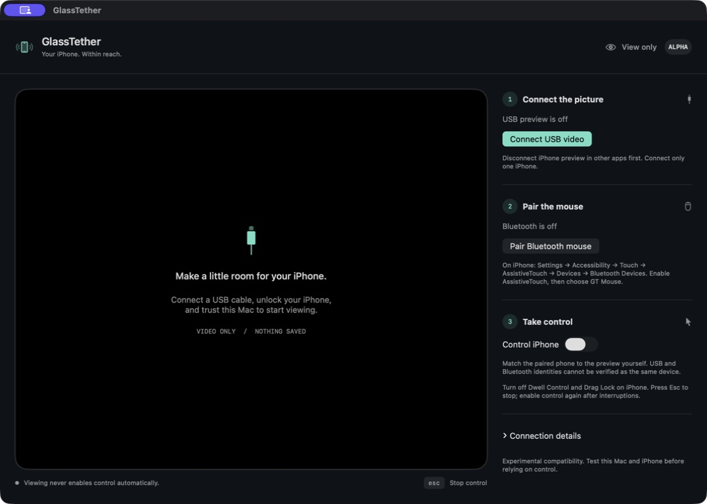

# GlassTether

**Your iPhone. Within reach.**

A native Mac app for wired iPhone video and Bluetooth absolute mouse control. Move into the visible phone picture to point, click and drag; move out to return to your Mac.

**Private alpha · working name · not publicly released.** This is a release candidate for review, not a claim of universal iPhone support. No license has been granted yet; see [publication status](docs/ORIGIN.md).

[GitHub repository](https://github.com/TinyQ/GlassTether) · [简体中文](README.zh-CN.md) · [Setup](docs/SETUP.md) · [Compatibility](docs/COMPATIBILITY.md) · [Architecture](docs/ARCHITECTURE.md)



Actual app window, with USB and Bluetooth off. This image is not evidence of phone control.

## What you get

- USB video preview that starts only when you connect it.
- A Bluetooth mouse paired through iPhone AssistiveTouch, with absolute position mapped to the actual video area.
- Explicit control switch, Esc to stop, release on exit, and automatic control shutdown on interrupted video, lost focus or a disconnected mouse.
- A small native interface with connection status, retry and optional discovery diagnostics.

No audio capture, recording, screenshot capture, OCR, network remote control, cloud account or saved input logs. This app does not forward keyboard typing or multitouch. An unlocked, trusted USB phone and separately paired Bluetooth mouse are required. The app cannot prove that both connections refer to the same phone.

## Build and run

Requires macOS 14+ as a build target and Xcode with Swift 6. Actual hardware compatibility is a separate question; consult the matrix before relying on control.

```sh
export DEVELOPER_DIR=/Applications/Xcode.app/Contents/Developer
swift test
./script/build.sh
```

Open the newly printed `dist/GlassTether-NNN.app` path in Finder. Builds are numbered, ad hoc signed, and never launched or installed automatically. Local binaries target the build machine architecture. This alpha is not notarized; do not distribute it as an end-user installer. There is no public download yet.

1. Disconnect phone preview in other apps. Connect and unlock one iPhone, trust the Mac, then click **Connect USB video**.
2. Click **Pair Bluetooth mouse** and pair **GT Mouse** from iPhone AssistiveTouch → Devices → Bluetooth Devices. Your Mac name may appear instead.
3. Confirm this is the phone shown in the preview. Disable Dwell Control and Drag Lock, then enable **Control iPhone**.
4. Move into the picture. Move out to return to Mac; press **Esc** to stop control. Interruptions require manually enabling it again.

The camera permission is used for USB video. Bluetooth permission is requested only when pairing starts. Nothing is recorded. See the [pairing and recovery guide](docs/SETUP.md).

## Evidence, not promises

The source demo's user confirmed absolute pointing at approximately (25%, 25%) and pointer following on one Mac/iPhone combination. That does **not** validate this renamed/refactored build, every iOS version, pixel accuracy, latency, or all button/exit paths. The iPhone model and iOS version were not recorded. [Validation details and remaining checks](docs/COMPATIBILITY.md).

## Why this exists

GlassTether explores a focused wired-video workflow with the Mac acting as a Bluetooth pointer. Apple's [iPhone Mirroring](https://support.apple.com/en-us/120421) offers wireless interaction, notifications and other system integrations; it uses a locked nearby phone and the same Apple Account. GlassTether implements no Apple Account sign-in, but its different transport does not establish broader regional or hardware support. [Research and naming notes](docs/POSITIONING.md).

## Contribute

Start with [CONTRIBUTING.md](CONTRIBUTING.md). The most useful early contribution is a reproducible hardware result with macOS, iOS, device model, app version and the exact checklist outcome. Do not include serial numbers, Bluetooth identifiers, private screenshots or personal notifications.

Source provenance and redistribution review: [ORIGIN](docs/ORIGIN.md), [file hashes](docs/PROVENANCE.json). Release preparation: [review packet](docs/RELEASE_REVIEW.md).
