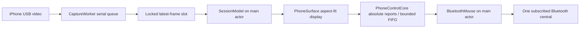

# Architecture

Swift 6 / native macOS, no package dependencies.

## Boundaries

`PhoneControlCore` contains pure coordinate mapping, report serialization, queue/backpressure and frame freshness policy. The inherited relative-report utility and its five regression tests remain as provenance-preserving support code; the app never selects or sends relative XY reports.

`GlassTether` is the executable module. `GlassTetherApp` owns lifecycle and the SwiftUI connection view; `SessionModel` owns explicit connection state, permission request generation, video freshness and control shutdown. `USBPreview` owns capture on one serial queue. `CoreMediaIODeviceDiscovery` requests wired screen devices through CoreMediaIO and selects a single muxed AVFoundation device. Discovery runs only after Connect. These CMIO system-object discovery properties should be checked for cross-process effects during coordinated hardware testing; no discovery is performed on launch.

`PhoneSurface` owns the display layer, actual aspect-fit image rectangle and local AppKit mouse events. It maps a top-left origin, rejects black bars, releases on geometry changes and ignores entering with an externally held mouse button. `NSCursor.hide()` is balanced only by the view that owns the hide. `BluetoothMouse` owns service registration, subscription, encryption-required input characteristic and the selected central. Only that central receives notifications; additional subscribers are not targeted. USB and BLE identity are not correlated.

## Wire contract

Generic Desktop Mouse/Pointer, report ID 1 in the descriptor and Report Reference `[1, 1]`. GATT input data excludes the ID: buttons (low 3 bits), X little-endian UInt16, Y little-endian UInt16, signed relative wheel. Axes range 0…32767; total 6 bytes. This is not a touchscreen or multitouch digitizer. Full canonical 128-bit service UUIDs are registered; standard discovery advertises short 1812.

The descriptor is unchanged from the validated absolute demo. Advertised name is GT Mouse and the experimental PnP product number differs. Manufacturer ID 0xFFFF is still a prototype placeholder, not a claimed SIG allocation. Resolve production identity before release; changing it requires new hardware pairing validation.

## Failure invariants

Start with no CBPeripheralManager, capture session or armed control. Only user actions start connections. A fresh preview plus subscribed mouse is required to enable control. Main actor checks also disarm on focus loss. Expiry uses monotonic capture time and a 0.6s threshold. No background monitor or automatic reconnect is installed.

Queue capacity is 256. Backpressure retains ordering; overflow discards queued input, replaces it with release at the last requested coordinate and disarms control. Disconnects and restart invalidate old input. A release attempt on quit cannot guarantee delivery over a disconnected radio. Capture generation tokens reject stale frames and delayed permission responses after disconnect.

No disk video, audio, OCR, input telemetry, network listeners, cloud calls or stored phone identifiers. Framework-managed Bluetooth bonds and permissions belong to macOS/iOS.
